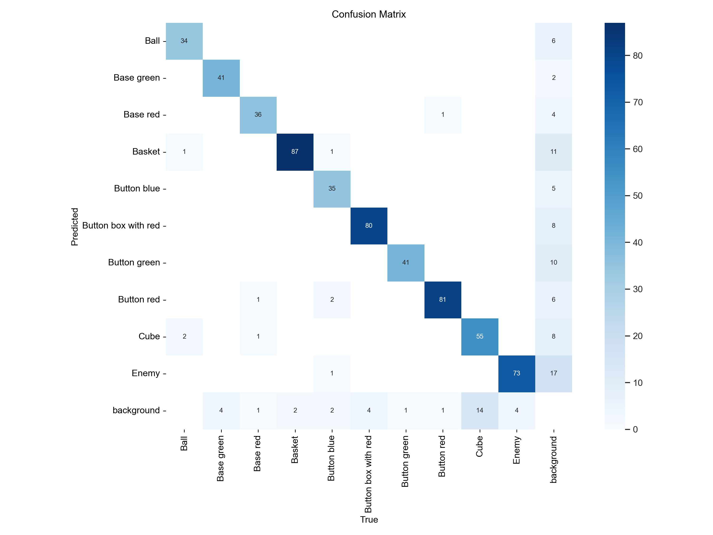
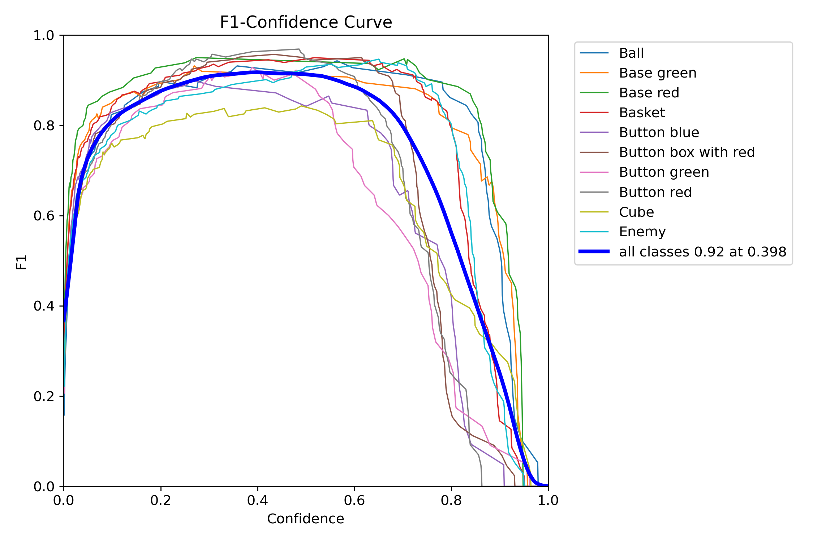
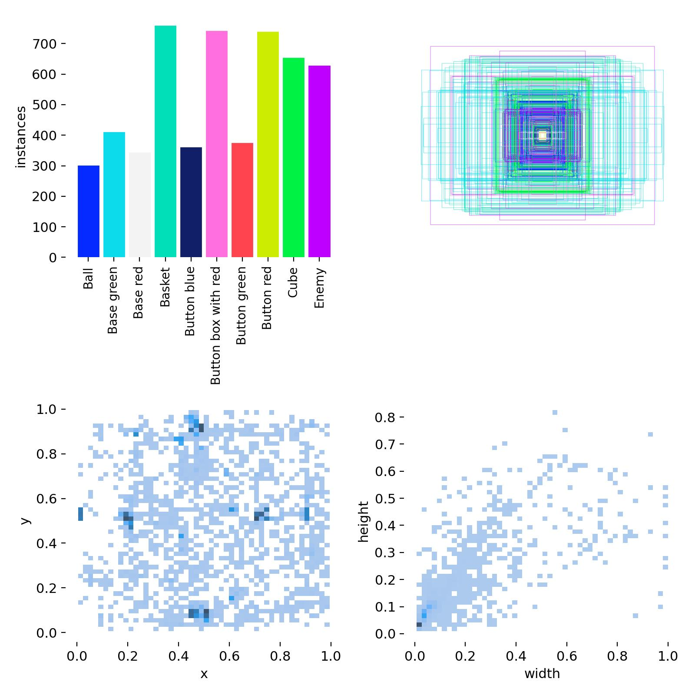
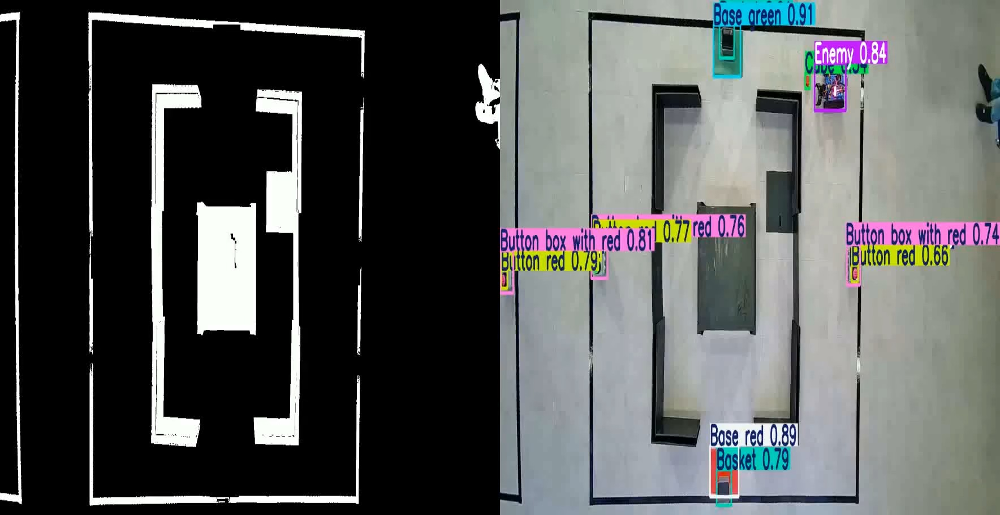
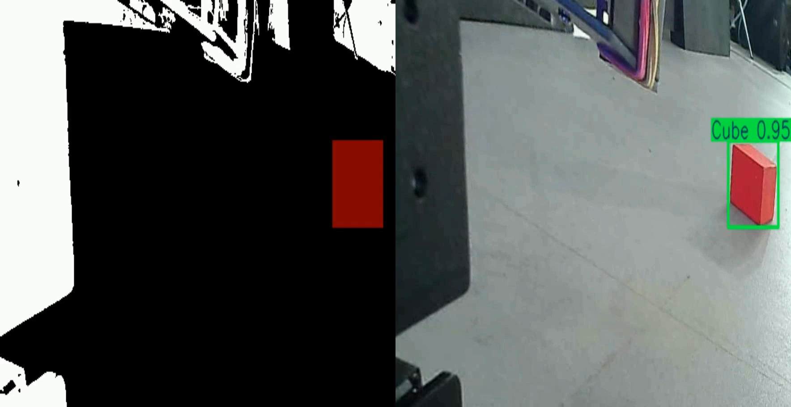

# AI-Robotics

## О чем репозиторий

В данном репозитории хотелось бы рассказать о своем первом и увлекательном опыте внедрения искусственного интеллекта для автоматизации движения и выполнений действий робота.

## В чем состояла задача

В данном файле представлен регламент хакатона.
[📄 Регламент Yandex Camp v3.pdf](data_for_present/reglament_yandex_camp_v3.pdf)

Если вкратце: нужно переносить объекты в корзинку и нажать на кнопку единожды. Также робот должен передвигаться, не врезаясь в стенки и другие объекты.

## Моя роль в команде

Так как в моей команде не было ни одного человека, работавшего с компьютерным зрением, данную ношу взял на себя я, оставив для других задачу механики и управления робота. Таким образом, моей задачей было:

* fine-tuning YOLO
* Выделение статического поля игры со стенами
* Определение открытых стенок в ящике, в котором лежит шарик
* Детекция объектов с верхней камеры
* Детекция объектов с нижней камеры

## Fine-tuning YOLO

Так как нужно было работать с видео в реальном времени, а на выданных ноутбуках не было GPU, пришлось использовать YOLOv5 nano от Ultralytics. Она удобна тем, что имеет небольшое количество параметров и отрабатывает на CPU всего за 0.08 секунды, что позволяет использовать её в реальном времени.

Код fine-тюнинга:
📘 [finetune\_yolo.ipynb](finetune_yolo.ipynb)

Метрики:

  
  
  

## Выделение статического поля игры со стенами

Механизм:

* Выравнивание искажений камеры
* ЧБ-фильтр и анализ градиентов для выделения объектов
* Поиск ящика и его стенок
* Определение проходимых сторон

**Результат:**

🎥 `static_top.mp4`

## Определение открытых стенок в ящике, в котором лежит шарик

Методика:

* Поиск коробки
* Анализ границ и распределения белых пикселей
* Определение открытых сторон (левая/правая = 16/17, верх/низ = 14/19)

📘 [find\_open\_boxes.ipynb](find_open_boxes.ipynb)

## Детекция объектов с верхней камеры

Этапы:

1. Рисуем статическое поле
2. Детектируем объекты
3. Объединяем с маской

**Результат:**

🎥 `dinamic_top.mp4`

## Детекция объектов с нижней камеры

Аналогично верхней, только с нижней камеры.

**Результат:**

🎥 `down_camera.mp4`

## Подытожим

Для чего всё это? Чтобы показать мощь компьютерного зрения в практическом применении. Без сложных нейросетей можно извлекать массу полезной информации — главное, понимать, как и что искать. Этот опыт дал мне невероятное вдохновение, ведь каждое изменение кода отражалось на движении реального робота. Отличный способ вспомнить CV после перерыва почти в год!
